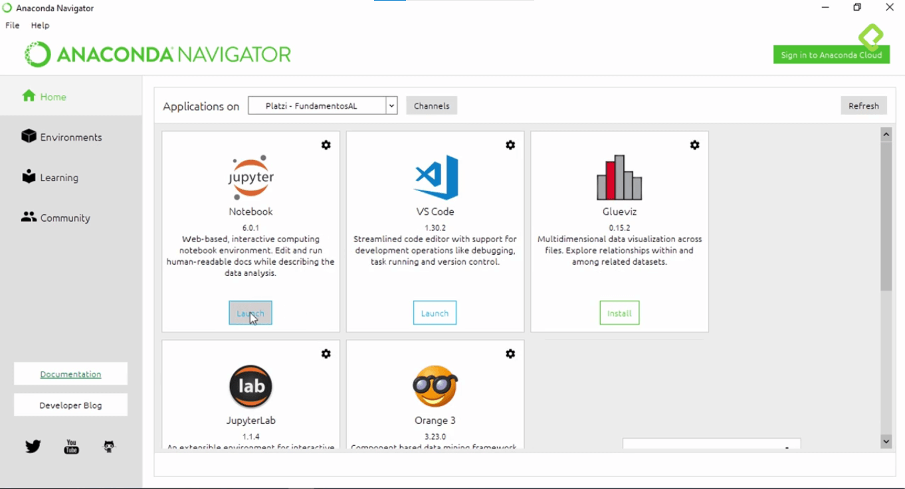
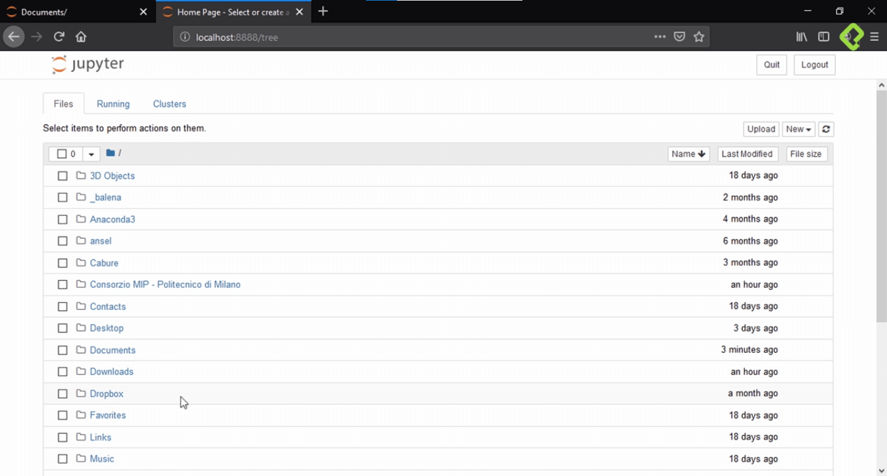

# USO DE JUOYTER NOTEBOOK

Jupyter son unos libro interativos que permiten mantener el código con el análisis de datos todo en un mismo lugar junto con la documentación y los gráficos a medida que se avanza con el análisis. Esto es importante, porque la documentación se realiza al tiempo que se avanza con el código, reduciendo tiempos y permitiendo un documento que se puede reproducir a otros desarrolladores.

Al momento de abrir anaconda se selecciona el ambiente virtual a utilizar

Se inicia Jupiter Notebook, el cuál abre una ventana de navegador 

Dentro de esta se selecciona donde se vana guardar los cambios, luego en la pestaña de la derecha arriba se selecciona una nuevo archivo de jupiter notebook python3.

El resto de la clase se puede ver en el notebook: [c03_uso_de_jupyter](./03_FundamentosAL/c03_uso_de_jupiter.ipynb)